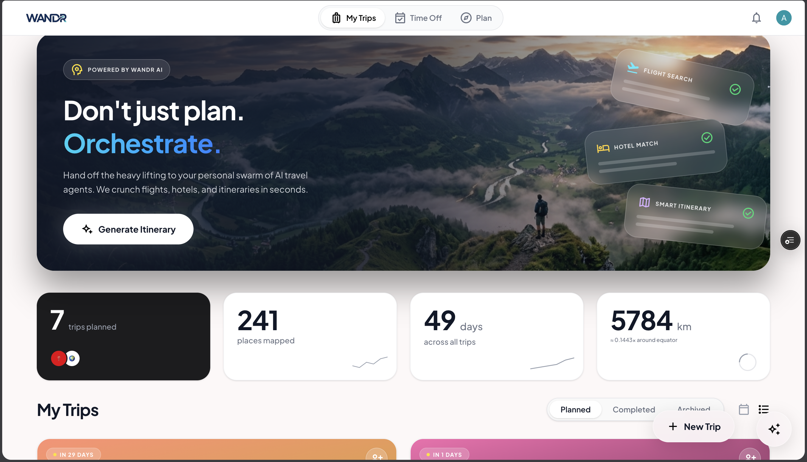
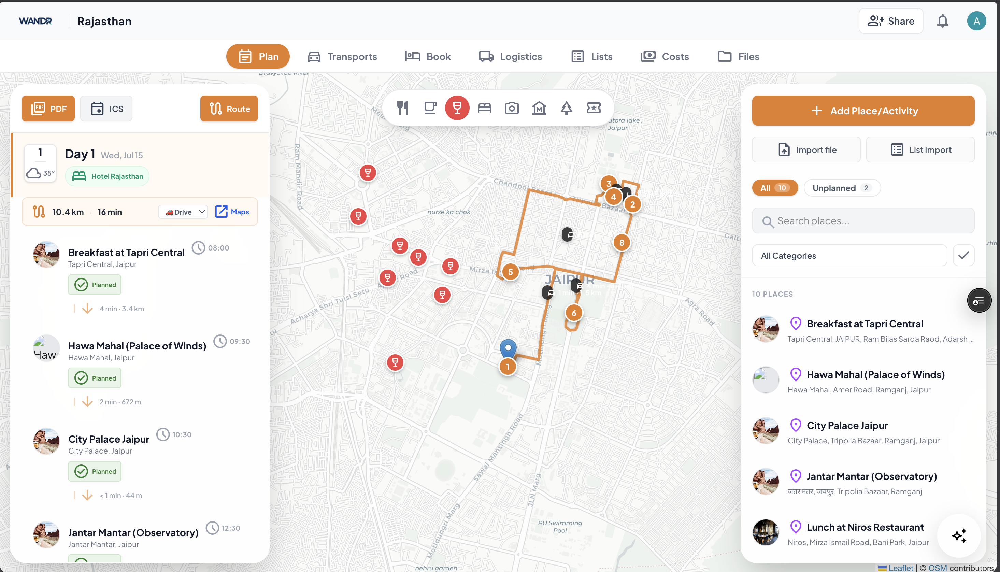
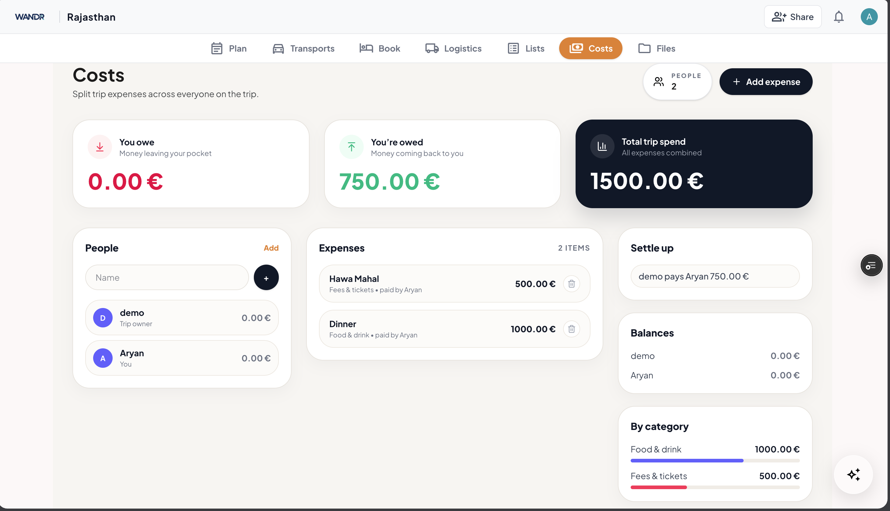
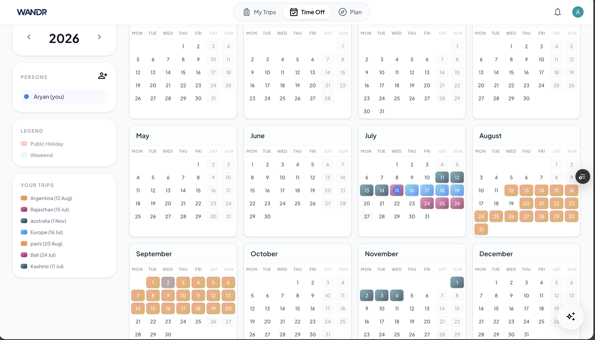
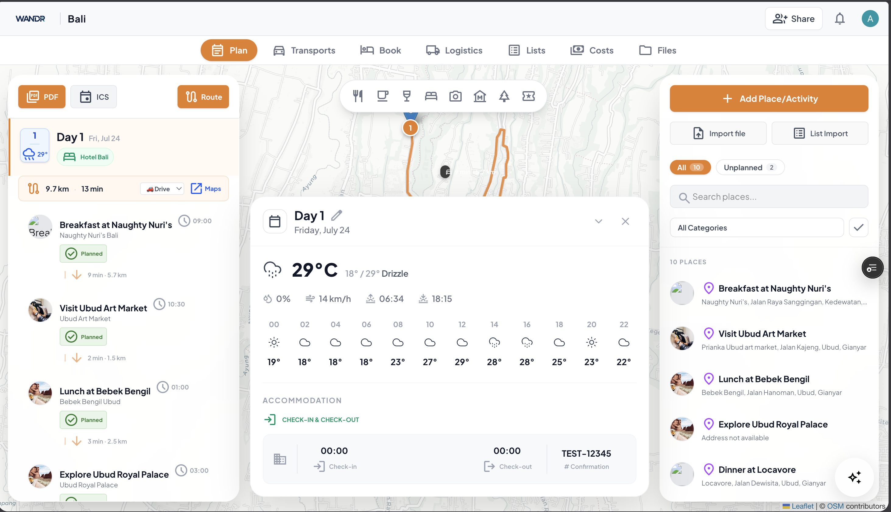

# WANDR

WANDR is a next-generation AI-powered travel planner that helps you effortlessly organize your vacations. From generating intelligent itineraries to splitting expenses and managing collaborative trips, WANDR acts as your smart co-pilot for exploring the world.

## Screenshots

| Dashboard | AI Itinerary |
| :---: | :---: |
|  |  |

| Cost Splitting | WANDR AI |
| :---: | :---: |
|  |  |

| Travel Calendar | Weather & Info |
| :---: | :---: |
|  |  |

## Features

- **AI-Generated Itineraries:** Instantly create personalized day-by-day travel plans using advanced LLMs (Google Gemini) and real-time data integration.
- **Flights & Hotels:** Get intelligent recommendations for flights and accommodation seamlessly woven into your trip.
- **Interactive Maps:** Visualize your route, places to visit, and track distances via integrated map services (Ola Maps / OpenStreetMap).
- **Expense Splitting (Costs):** Add trip buddies, track expenses in different currencies, and let the app automatically calculate who owes what.
- **Collaborative Planning:** Invite friends to your trip. Edit itineraries, upload files, and plan logistics together in real time.
- **Integrated File Manager:** Drag and drop tickets, PDFs, and images (powered by Cloudflare R2 / S3) directly into individual trips.
- **Trip Management:** Keep your dashboard clean by archiving old trips and tracking upcoming vs. completed vacations.

## Tech Stack

**Frontend:**
- [Next.js](https://nextjs.org/) (React Framework)
- [Tailwind CSS](https://tailwindcss.com/) for modern, responsive, glass-morphism styling.
- [TypeScript](https://www.typescriptlang.org/)
- Authentication via Clerk
- Deployed on **Vercel**

**Backend:**
- [FastAPI](https://fastapi.tiangolo.com/) (Python)
- [PostgreSQL](https://www.postgresql.org/) (Database via Neon)
- SQLAlchemy (Async ORM)
- Cloudflare R2 (S3-compatible Object Storage for files)
- Deployed on **Render**

## Getting Started

### Prerequisites
- Node.js (v18+)
- Python (3.9+)
- PostgreSQL Database

### 1. Clone the repository
```bash
git clone https://github.com/Aryankumar1729/Wondr.git
cd Wondr
```

### 2. Frontend Setup
```bash
cd frontend
npm install

# Set up your environment variables
cp .env.example .env.local 
# (Add your NEXT_PUBLIC_API_URL and Clerk keys)

npm run dev
```

### 3. Backend Setup
```bash
cd backend
python -m venv venv
source venv/bin/activate  # On Windows: venv\Scripts\activate
pip install -r requirements.txt

# Set up your environment variables
cp .env.example .env
# (Add your DATABASE_URL, GEMINI_API_KEY, R2 secrets, etc.)

uvicorn app.main:app --reload --port 8000
```

## Contributing

Contributions are always welcome! Feel free to open an issue or submit a pull request if you have ideas on how to improve WANDR.
